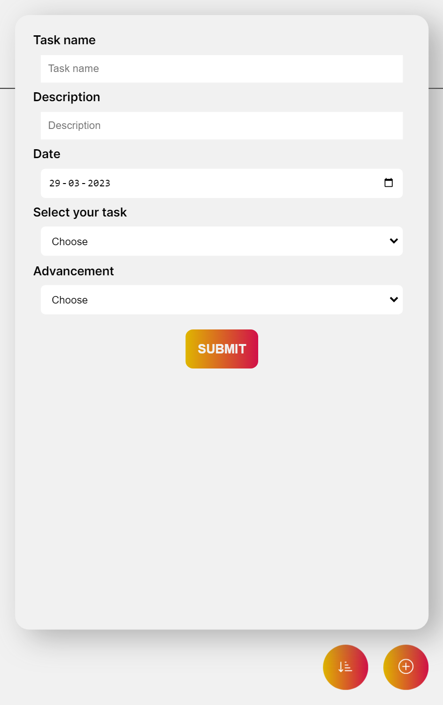
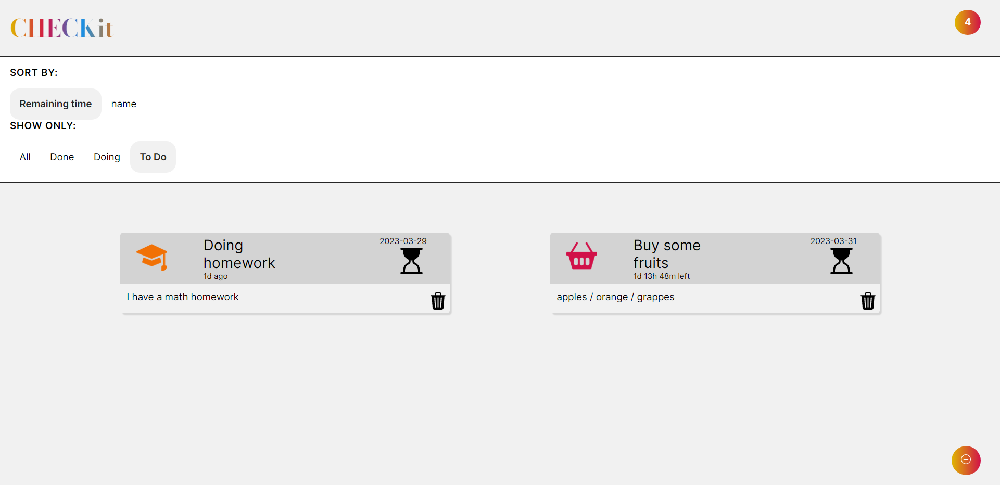

# Planner-Project

## Welcome to this repository

This repository was created on **December 14th 2022**. The team working on the repository is a three people team from the BeCode training bootcamp. 

## Versions 

2022-12-16:
- First working version.

## Known Issues
- Deletion causing some issues (object not updating).
## Screenshots

## 🔗 Links
https://lysiesoyez.github.io/Planner-Project/

